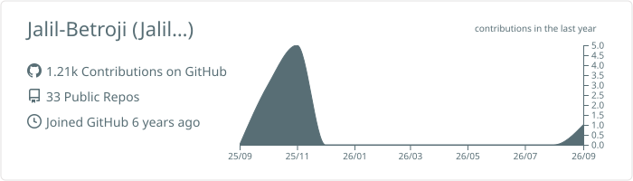
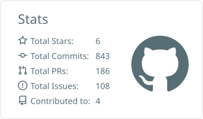
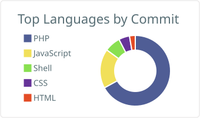

# 👋 Hi, I'm Jalil Betroji

### Full-Stack Developer · SaaS Builder · Founder & CEO @ Quartinno

I build **scalable web applications, SaaS platforms, APIs and automation systems** that turn ideas and business problems into production-ready digital products.

 

&nbsp;

&nbsp;

---

## 📊 GitHub Statistics

 

---

## ⚡ About Me

I'm a **Full-Stack Developer and Founder & CEO of Quartinno**, focused on building technology that solves real-world business problems.

**Idea → Architecture → Build → Deploy → Optimize → Scale 🚀**

 

<table>
<tr><td>💻 <b>Full-Stack Development</b></td><td>🚀 <b>SaaS & Digital Products</b></td></tr>
<tr><td>⚙️ <b>Business Automation</b></td><td>🔌 <b>APIs & Integrations</b></td></tr>
<tr><td>☁️ <b>DevOps & Infrastructure</b></td><td>🧠 <b>System Architecture</b></td></tr>
</table>

---

## 🛠️ Tech Stack

  

  

---

## 🚀 Selected Work

<table>
<tr>
<td width="50%" valign="top">

### 💳 Quartap
**NFC Business Platform**

NFC devices, digital profiles, dynamic destinations, lead capture, analytics and business management.

`Laravel` `MySQL` `REST API` `NFC`

</td>
<td width="50%" valign="top">

### 📧 Quartlead
**Email Infrastructure Platform**

Campaign management, backend processing and email infrastructure.

`Go` `Laravel` `React` `PostgreSQL`

</td>
</tr>
<tr>
<td width="50%" valign="top">

### 🧼 Hyprocol
**Professional E-commerce Platform**

Production Laravel platform with product management, search, SEO and performance optimization.

`Laravel` `Blade` `MySQL` `Tailwind`

</td>
<td width="50%" valign="top">

### 🏡 Villa Le Rocher
**Property & Booking Website**

SEO-focused property website designed for discovery and direct booking conversion.

`SEO` `Performance` `Responsive` `UX`

</td>
</tr>
</table>

---

## 🏢 Founder & CEO @ Quartinno

<table>
<tr>
<td width="70%" valign="middle">

I'm the **Founder & CEO of Quartinno**, a technology company focused on transforming business challenges into digital solutions.

We build **web platforms, SaaS products, mobile applications, business automation, CRM/ERP solutions, APIs and digital infrastructure.**

> **A Mission to Innovate, Quartinno Elevates.**

</td>
<td width="30%" align="center">

### BUILD
↓
### AUTOMATE
↓
### SCALE 🚀

</td>
</tr>
</table>

---

## 🔭 Currently Building

---

## 🤝 Let's Connect

Interested in **SaaS · Startups · Automation · Web Development · Digital Products**

  

  

### Building Products · Solving Problems · Shipping to Production 🚀

